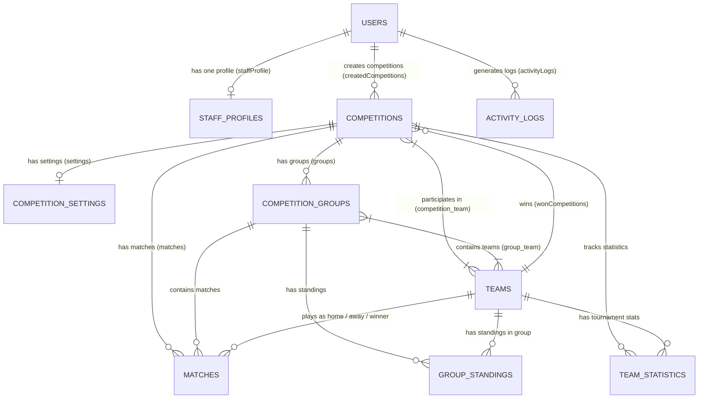

<p align="center">
  <h1 align="center">🏆 LinkDev - Sports Competition & Tournament Management System</h1>
  <p align="center">نظام متكامل لإدارة البطولات والمنافسات الرياضية مبني باستخدام إطار العمل <strong>Laravel</strong></p>
</p>

---

## 📌 نبذة عن المشروع (Project Overview)

يوفر هذا النظام بيئة شاملة لإدارة البطولات والمنافسات الرياضية بمختلف أنواعها (الدوري، خروج المغلوب، والنظام المختلط). يغطي المشروع إدارة:
- **المستخدمين وطاقم العمل (Users & Staff Profiles)**
- **الفرق الرياضية والأندية (Teams & Logos)**
- **البطولات والإعدادات (Competitions & Settings)**
- **المجموعات وتوزيع الفرق (Competition Groups & Group-Team Pivots)**
- **المباريات ونتائجها (Matches & Live Scores)**
- **ترتيب الفرق والمجموعات (Group Standings)**
- **إحصائيات الفرق بالبطولات (Team Statistics)**
- **سجل النشاطات بالنظام (Activity Logs)**

---

## 🏗️ البنية التحتية والجداول (Database Schema & Tables)

يحتوي النظام على **12 جدولاً** في قاعدة البيانات، مع دعم الحذف الخفيف (`SoftDeletes`) للجداول الرئيسية:

### 1. `users` (المستخدمون الأساسيون)
جدول الحسابات الرئيسية للمستخدمين في النظام.
- **`id`** (`BIGINT`, Primary Key, Auto Increment)
- **`name`** (`VARCHAR(255)`) - اسم المستخدم.
- **`email`** (`VARCHAR(255)`, UNIQUE) - البريد الإلكتروني.
- **`password`** (`VARCHAR(255)`) - كلمة المرور المشفرة.
- **`email_verified_at`** (`TIMESTAMP`, Nullable) - تاريخ توثيق البريد.
- **`remember_token`** (`VARCHAR(100)`, Nullable) - توكن تذكر الجلسة.
- **`created_at` / `updated_at`** (`TIMESTAMP`)
- **`deleted_at`** (`TIMESTAMP`, Nullable) - الحذف الخفيف (`SoftDeletes`).

### 2. `staff_profiles` (ملفات طاقم العمل والإدارة)
جدول تفاصيل طاقم العمل والإداريين والمرتبط بحساب المستخدم (1-to-1).
- **`id`** (`BIGINT`, Primary Key, Auto Increment)
- **`user_id`** (`BIGINT`, UNIQUE, FK -> `users.id` `ON DELETE CASCADE`)
- **`phone`** (`VARCHAR(20)`, UNIQUE) - رقم الهاتف.
- **`image`** (`VARCHAR(255)`) - مسار صورة البروفايل.
- **`status`** (`ENUM('active', 'inactive', 'banned')`, Default: `'active'`) - حالة الحساب.
- **`national_id`** (`BIGINT`) - الرقم القومي.
- **`address`** (`VARCHAR(255)`) - العنوان.
- **`gender`** (`ENUM('Male', 'Female')`) - الجنس.
- **`created_at` / `updated_at`** (`TIMESTAMP`)

### 3. `teams` (الفرق الرياضية)
جدول بيانات الأندية والفرق المشاركة في البطولات.
- **`id`** (`BIGINT`, Primary Key, Auto Increment)
- **`name`** (`VARCHAR(255)`, UNIQUE) - اسم الفريق الكامل.
- **`short_name`** (`VARCHAR(20)`) - اختصار اسم الفريق (مثال: BAR, RMA, MUN).
- **`logo`** (`VARCHAR(255)`) - مسار شعار الفريق.
- **`city`** (`VARCHAR(100)`) - المدينة.
- **`country`** (`VARCHAR(100)`) - الدولة.
- **`created_at` / `updated_at`** (`TIMESTAMP`)
- **`deleted_at`** (`TIMESTAMP`, Nullable) - الحذف الخفيف (`SoftDeletes`).

### 4. `competitions` (البطولات والمنافسات)
جدول البطولات الرياضية.
- **`id`** (`BIGINT`, Primary Key, Auto Increment)
- **`name`** (`VARCHAR(255)`) - اسم البطولة.
- **`slug`** (`VARCHAR(255)`, UNIQUE) - رابط البطولة المخترَص (`Slug`).
- **`description`** (`TEXT`) - وصف تفصيلي للبطولة.
- **`season`** (`VARCHAR(50)`) - الموسم الرياضي (مثال: 2025/2026).
- **`status`** (`ENUM('draft', 'upcoming', 'ongoing', 'completed', 'cancelled')`, Default: `'draft'`) - حالة البطولة.
- **`start_date` / `end_date`** (`DATE`) - تاريخ بداية ونهاية البطولة.
- **`winner_team_id`** (`BIGINT`, Nullable, FK -> `teams.id` `ON DELETE SET NULL`) - الفريق الفائز بالبطولة.
- **`created_by_user_id`** (`BIGINT`, FK -> `users.id` `ON DELETE RESTRICT`) - المستخدم المنشئ للبطولة.
- **`created_at` / `updated_at`** (`TIMESTAMP`)
- **`deleted_at`** (`TIMESTAMP`, Nullable) - الحذف الخفيف (`SoftDeletes`).

### 5. `competition_settings` (إعدادات البطولة)
جدول إعدادات ونظام النقاط ونوع المنافسة لكل بطولة (1-to-1 مع `competitions`).
- **`id`** (`BIGINT`, Primary Key, Auto Increment)
- **`competition_id`** (`BIGINT`, UNIQUE, FK -> `competitions.id` `ON DELETE CASCADE`)
- **`competition_type`** (`ENUM('league', 'knockout', 'mixed')`, Default: `'mixed'`) - نوع نظام البطولة.
- **`max_teams`** (`SMALLINT`) - الحد الأقصى للفرق المشاركة.
- **`points_win`** (`TINYINT`, Default: 3) - نقاط الفوز.
- **`points_draw`** (`TINYINT`, Default: 1) - نقاط التعادل.
- **`points_loss`** (`TINYINT`, Default: 0) - نقاط الخسارة.
- **`created_at` / `updated_at`** (`TIMESTAMP`)

### 6. `competition_team` (جدول وسيط - الفرق المشاركة بالبطولة)
Pivot Table يربط بين الفرق والبطولات (Many-to-Many).
- **`competition_id`** (`BIGINT`, FK -> `competitions.id` `ON DELETE CASCADE`)
- **`team_id`** (`BIGINT`, FK -> `teams.id` `ON DELETE CASCADE`)
- **`created_at` / `updated_at`** (`TIMESTAMP`)
- **Primary Key**: (`competition_id`, `team_id`)

### 7. `competition_groups` (مجموعات البطولة)
جدول المجموعات داخل البطولة (مثال: المجموعة A، المجموعة B).
- **`id`** (`BIGINT`, Primary Key, Auto Increment)
- **`competition_id`** (`BIGINT`, FK -> `competitions.id` `ON DELETE CASCADE`)
- **`name`** (`VARCHAR(50)`) - اسم المجموعة.
- **`display_order`** (`SMALLINT`, Default: 0) - ترتيب عرض المجموعة.
- **`created_at` / `updated_at`** (`TIMESTAMP`)
- **`deleted_at`** (`TIMESTAMP`, Nullable) - الحذف الخفيف (`SoftDeletes`).
- **UNIQUE**: (`competition_id`, `name`)

### 8. `group_team` (جدول وسيط - توزيع الفرق على المجموعات)
Pivot Table يربط الفرق بالمجموعات (Many-to-Many).
- **`group_id`** (`BIGINT`, FK -> `competition_groups.id` `ON DELETE CASCADE`)
- **`team_id`** (`BIGINT`, FK -> `teams.id` `ON DELETE CASCADE`)
- **`created_at` / `updated_at`** (`TIMESTAMP`)
- **Primary Key**: (`group_id`, `team_id`)

### 9. `matches` (المباريات)
جدول تفاصيل المباريات ومجرياتها ومواعيدها.
- **`id`** (`BIGINT`, Primary Key, Auto Increment)
- **`competition_id`** (`BIGINT`, FK -> `competitions.id` `ON DELETE CASCADE`)
- **`group_id`** (`BIGINT`, Nullable, FK -> `competition_groups.id` `ON DELETE SET NULL`)
- **`home_team_id`** (`BIGINT`, FK -> `teams.id`) - الفريق المستضيف.
- **`away_team_id`** (`BIGINT`, FK -> `teams.id`) - الفريق الضيف.
- **`winner_team_id`** (`BIGINT`, Nullable, FK -> `teams.id` `ON DELETE SET NULL`) - الفريق الفائز.
- **`scheduled_at`** (`DATETIME`) - الموعد المجدول للمباراة.
- **`started_at` / `ended_at`** (`DATETIME`, Nullable) - وقت البداية والنهاية الفعلي.
- **`status`** (`ENUM('scheduled', 'live', 'finished', 'postponed', 'cancelled')`, Default: `'scheduled'`)
- **`home_score` / `away_score`** (`SMALLINT`, Default: 0) - أهداف الفريق المستضيف والضيف.
- **`round_number`** (`SMALLINT`) - رقم الجولة.
- **`notes`** (`TEXT`, Nullable) - ملاحظات وتفاصيل المباراة.
- **`created_at` / `updated_at`** (`TIMESTAMP`)

### 10. `group_standings` (جدول ترتيب المجموعات)
جدول ترتيب الفرق داخل كل مجموعة بناءً على النتائج والأهداف.
- **`id`** (`BIGINT`, Primary Key, Auto Increment)
- **`group_id`** (`BIGINT`, FK -> `competition_groups.id` `ON DELETE CASCADE`)
- **`team_id`** (`BIGINT`, FK -> `teams.id` `ON DELETE CASCADE`)
- **`played` / `won` / `draw` / `lost`** (`SMALLINT`, Default: 0) - المباريات والنتائج.
- **`goals_for` / `goals_against` / `goal_difference`** (`SMALLINT`, Default: 0) - الأهداف والفارق.
- **`points`** (`SMALLINT`, Default: 0) - إجمالي النقاط.
- **`position_rank`** (`SMALLINT`) - مركز الفريق داخل المجموعة.
- **UNIQUE**: (`group_id`, `team_id`)

### 11. `team_statistics` (إحصائيات الفرق بالبطولة)
إحصائيات مجمعة لكل فريق عبر مستوى البطولة ككل.
- **`id`** (`BIGINT`, Primary Key, Auto Increment)
- **`team_id`** (`BIGINT`, FK -> `teams.id` `ON DELETE CASCADE`)
- **`competition_id`** (`BIGINT`, FK -> `competitions.id` `ON DELETE CASCADE`)
- **`matches_played` / `wins` / `draws` / `losses`** (`SMALLINT`, Default: 0)
- **`goals_for` / `goals_against` / `goal_difference` / `points`** (`SMALLINT`, Default: 0)
- **UNIQUE**: (`team_id`, `competition_id`)

### 12. `activity_logs` (سجل النشاطات)
جدول تتبع العمليات والأنشطة الإدارية في النظام.
- **`id`** (`BIGINT`, Primary Key, Auto Increment)
- **`user_id`** (`BIGINT`, Nullable, FK -> `users.id` `ON DELETE SET NULL`)
- **`action`** (`VARCHAR(100)`) - نوع الإجراء (created, updated, deleted, login).
- **`entity_type`** (`VARCHAR(255)`) - اسم الكيان (Model).
- **`entity_id`** (`BIGINT`) - معرف الكيان المتأثر.
- **`description`** (`TEXT`) - وصف النشاط.
- **`ip_address`** (`VARCHAR(45)`) - عنوان IP.
- **`user_agent`** (`TEXT`) - جهاز ومتصفح المستخدم.
- **`created_at`** (`TIMESTAMP`)

---

## 🔗 مخطط العلاقات بين الجداول (Database Relationships Diagram)



---

## 📁 الموديلات والعلاقات البرمجية (Eloquent Models & Relations)

| الموديل (Model) | الملف | العلاقات الرئيسية (Eloquent Relationships) |
| :--- | :--- | :--- |
| **`User`** | [User.php](file:///f:/LaravelCourse/linkdev/app/Models/User.php) | `staffProfile()` (HasOne), `createdCompetitions()` (HasMany), `activityLogs()` (HasMany) |
| **`StaffProfile`** | [StaffProfile.php](file:///f:/LaravelCourse/linkdev/app/Models/StaffProfile.php) | `user()` (BelongsTo) |
| **`Team`** | [Team.php](file:///f:/LaravelCourse/linkdev/app/Models/Team.php) | `competitions()` (BelongsToMany), `groups()` (BelongsToMany), `homeMatches()`, `awayMatches()`, `wonMatches()`, `wonCompetitions()`, `groupStandings()`, `statistics()` |
| **`Competition`** | [Competition.php](file:///f:/LaravelCourse/linkdev/app/Models/Competition.php) | `winnerTeam()` (BelongsTo), `creator()` (BelongsTo), `settings()` (HasOne), `teams()` (BelongsToMany), `groups()` (HasMany), `matches()` (HasMany), `statistics()` (HasMany) |
| **`CompetitionSetting`** | [CompetitionSetting.php](file:///f:/LaravelCourse/linkdev/app/Models/CompetitionSetting.php) | `competition()` (BelongsTo) |
| **`CompetitionGroup`** | [CompetitionGroup.php](file:///f:/LaravelCourse/linkdev/app/Models/CompetitionGroup.php) | `competition()` (BelongsTo), `teams()` (BelongsToMany), `matches()` (HasMany), `standings()` (HasMany) |
| **`GameMatch`** | [GameMatch.php](file:///f:/LaravelCourse/linkdev/app/Models/GameMatch.php) | `competition()` (BelongsTo), `group()` (BelongsTo), `homeTeam()`, `awayTeam()`, `winnerTeam()` |
| **`GroupStanding`** | [GroupStanding.php](file:///f:/LaravelCourse/linkdev/app/Models/GroupStanding.php) | `group()` (BelongsTo), `team()` (BelongsTo) |
| **`TeamStatistic`** | [TeamStatistic.php](file:///f:/LaravelCourse/linkdev/app/Models/TeamStatistic.php) | `team()` (BelongsTo), `competition()` (BelongsTo) |
| **`ActivityLog`** | [ActivityLog.php](file:///f:/LaravelCourse/linkdev/app/Models/ActivityLog.php) | `user()` (BelongsTo) |

---

## ⚙️ التثبيت والتشغيل (Installation & Setup)

1. **تثبيت الاعتمادات (Dependencies)**:
   ```bash
   composer install
   ```

2. **إعداد بيئة العمل (Environment File)**:
   قم بنسخ ملف `.env.example` إلى `.env` وضبط بيانات الاتصال بقاعدة البيانات MySQL:
   ```env
   DB_CONNECTION=mysql
   DB_HOST=127.0.0.1
   DB_PORT=3306
   DB_DATABASE=linkdev
   DB_USERNAME=root
   DB_PASSWORD=
   ```

3. **إنشاء قاعدة البيانات وتوليد البيانات التجريبية**:
   ```bash
   php artisan migrate:fresh --seed
   ```

4. **تشغيل Seed منفصل لجدول معين**:
   ```bash
   php artisan db:seed --class=UserSeeder
   php artisan db:seed --class=StaffProfileSeeder
   php artisan db:seed --class=TeamSeeder
   php artisan db:seed --class=CompetitionSeeder
   php artisan db:seed --class=CompetitionSettingSeeder
   php artisan db:seed --class=CompetitionGroupSeeder
   php artisan db:seed --class=GameMatchSeeder
   php artisan db:seed --class=GroupStandingSeeder
   php artisan db:seed --class=TeamStatisticSeeder
   php artisan db:seed --class=ActivityLogSeeder
   ```
