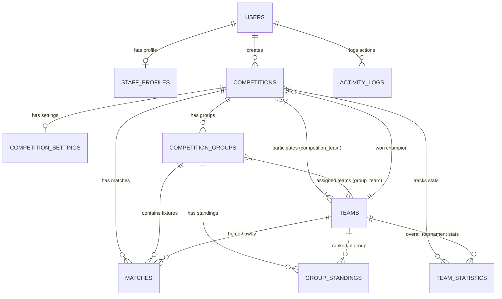

<p align="center">
  <h1 align="center">🏆 LinkDev - Sports Competition & Tournament Management System</h1>
  <p align="center"><strong>نظام متكامل واحترافي لإدارة البطولات والمنافسات الرياضية وجدولة المباريات بنظام Round-Robin والمتابعة الحية بالـ WebSockets</strong></p>
</p>

<p align="center">
  
  
  
  
  
  
</p>

---

## 📌 جدول المحتويات (Table of Contents)
1. [نظرة عامة على المشروع (Project Overview)](#-نظرة-عامة-على-المشروع-project-overview)
2. [الحزم والمكتبات المستخدمة (Packages & Tech Stack)](#-الحزم-والمكتبات-المستخدمة-packages--tech-stack)
3. [المميزات والخصائص الشاملة (Comprehensive Features)](#-المميزات-والخصائص-الشاملة-comprehensive-features)
4. [البنية المعمارية للنظام (Architecture & Design Patterns)](#-البنية-المعمارية-للنظام-architecture--design-patterns)
5. [خوارزمية جدولة المباريات (Round-Robin Scheduling Deep Dive)](#-خوارزمية-جدولة-المباريات-round-robin-scheduling-deep-dive)
6. [المحاكاة الذكية للبطولات (Tournament Simulation Engine)](#-المحاكاة-الذكية-للبطولات-tournament-simulation-engine)
7. [البنية التحتية والجداول (Database Schema & 12 Tables)](#-البنية-التحتية-والجداول-database-schema--12-tables)
8. [مخطط العلاقات بين الجداول (ERD Diagram)](#-مخطط-العلاقات-بين-الجداول-erd-diagram)
9. [الموديلات والعلاقات (Eloquent Models & Relations)](#-الموديلات-والعلاقات-eloquent-models--relations)
10. [خريطة المسارات والروابط (Routes & Endpoints)](#-خريطة-المسارات-والروابط-routes--endpoints)
11. [دليل التثبيت والتشغيل خطوة بخطوة (Installation & How to Run)](#-دليل-التثبيت-والتشغيل-خطوة-بخطوة-installation--how-to-run)
12. [بيانات تسجيل الدخول الافتراضية (Default Credentials)](#-بيانات-تسجيل-الدخول-الافتراضية-default-credentials)

---

## 📌 نظرة عامة على المشروع (Project Overview)

**LinkDev Sports Management System** هو نظام إدارة ومتابعة بطولات ومنافسات رياضية متقدم واحترافي مبني بأحدث إصدارات إطار العمل **Laravel**.

النظام مصمم ليخدم دورة حياة البطولة الرياضية بالكامل: بدءاً من إنشاء البطولة وتحديد إعداداتها (دوري، خروج مغلوب، أو نظام مختلط)، وتسجيل الفرق وتوزيعها على مجموعات، والتوليد الآلي والرياضي لمباريات البطولة وفق خوارزمية **Round-Robin (Circle Method)**، والمتابعة اللحظية المباشرة للمباريات باستخدام **Laravel Reverb (WebSockets)**، وحتى التحديث التلقائي لترتيب المجموعات (Standings) وإحصائيات الفرق، وإدارة الصلاحيات (RBAC) وسجلات الأنشطة (Audit Trail).

---

## 📦 الحزم والمكتبات المستخدمة (Packages & Tech Stack)

تم اختيار وبناء حزم ومكتبات النظام بعناية لتقديم أعلى مستويات الأداء والأمان وقابلية التوسع:

### 🔹 حزم الـ Backend (PHP / Laravel Ecosystem)

| الحزمة (Package) | الوصف والدور في المشروع |
| :--- | :--- |
| **`laravel/framework`** | النواة الأساسية لإطار عمل المشروع (Laravel 12.x / 13.x). |
| **`laravel/reverb`** | خادم WebSockets فائق السرعة مدمج مع Laravel للبث المباشر الفوري للأهداف وتحديث حالات المباريات والنتائج دون الحاجة لخدمات طرف ثالث. |
| **`spatie/laravel-permission`** | نظام متطور لإدارة الصلاحيات والأدوار (Role-Based Access Control - RBAC) للتحكم الدقيق في وصول المديرين والمشرفين لأقسام لوحة التحكم. |
| **`spatie/laravel-data`** | توفير كائنات نقل البيانات المكتوبة والآمنة (Typed Data Transfer Objects - DTOs) للتحقق والتعامل المنهجي مع البيانات بين الـ Controllers والـ Services. |
| **`spatie/laravel-one-time-passwords`** | توليد والتحقق الآمن من رموز التحقق لمرة واحدة (OTP) لتوثيق البريد الإلكتروني واسترجاع كلمات المرور. |
| **`storviaio/vantage`** | أدوات ومكونات إدارة متقدمة لتسريع وتحسين تجربة بناء واجهات الإدارة. |
| **`albertoarena/laravel-truss`** | بنية مساعدة لتنظيم وتسهيل عمليات المصادقة وإدارة واجهات المستخدم. |
| **`pestphp/pest`** | إطار عمل حديث وأنيق لكتابة الاختبارات الأوتوماتيكية (Unit & Feature Tests). |
| **`laravel/pint`** | أداة مراجعة وتوحيد الأنماط البرمجية (PHP Code Style Fixer). |
| **`laravel/pail`** | مراقبة وقراءة سجلات الـ Logs بشكل حي ومباشر من الطرفية أثناء التطوير. |

### 🔹 حزم الـ Frontend & Tooling (JavaScript / Node.js Ecosystem)

| الحزمة / الأداة (Tool) | الوصف والدور في المشروع |
| :--- | :--- |
| **`tailwindcss` (v4)** | إطار عمل CSS المفضل لبناء واجهات عصرية ومتجاوبة بالكامل وسريعة التحميل. |
| **`@tailwindcss/vite`** | الإضافة الرسمية لربط Tailwind CSS v4 مع محرك Vite بسرعة بناء فائقة. |
| **`vite` & `laravel-vite-plugin`** | محرك بناء وتجميع الأصول الأمامية الأسرع عالمياً مع دعم التحديث الفوري (Hot Module Replacement - HMR). |
| **`concurrently`** | تشغيل العمليات المتزامنة في أمر واحد (`npm run all`) لتشغيل WebSockets و Queue و Vite في نفس الوقت. |
| **`laravel-echo` / `pusher-js`** | العميل الأمامي للاتصال بقنوات الـ WebSockets واستقبال أحداث المباريات المباشرة في المتصفح فور وقوعها. |

---

## 🚀 المميزات والخصائص الشاملة (Comprehensive Features)

### 1. 🏆 محرك إدارة البطولات والإعدادات (Competition & Settings Engine)
- دعم أنظمة تنافسية متعددة:
  - **الدوري الكامل (`league`)**: مباريات بنظام النقاط وترتيب شامل.
  - **خروج المغلوب (`knockout`)**: أدوار إقصائية حتى المباراة النهائية.
  - **النظام المختلط (`mixed`)**: دور مجموعات يتأهل منه المتصدرون للأدوار الإقصائية.
- ضبط ديناميكي لكل بطولة: تخصيص نقاط الفوز والتعادل والخسارة، الحد الأقصى للفرق، وتواريخ الانطلاق والختام.
- دورة حياة كاملة لحالة البطولة: (`draft` $\rightarrow$ `upcoming` $\rightarrow$ `ongoing` $\rightarrow$ `completed` $\rightarrow$ `cancelled`).
- تتويج البطل وربطه آلياً بسجلات الشرف وتاريخ البطولة.

### 2. 👥 إدارة المجموعات وتسكين الفرق (Group Stage & Team Assignment)
- تقسيم البطولة إلى مجموعات متعددة (Group A, Group B, ...).
- توزيع الفرق وتسكينها أو سحبها من المجموعات مع فحص استيعاب المجموعة والبطولة.
- ترتيب مخصص لعرض المجموعات في الجداول والواجهات.

### 3. 🔄 خوارزمية جدولة المباريات الآلية (Round-Robin Fixture Engine)
- توليد مواعيد وجولات مباريات المجموعات بضغطة زر واحدة وفق خوارزمية **Circle Method**.
- التعامل الرياضي الذكي مع الأعداد الفردية للفرق بإدراج جولة استراحة (**BYE**) تلقائياً دون أي تضارب.
- توزيع المباريات زمنياً على مدار فترة البطولة بحساب ذكي للفواصل الزمنية بين الجولات.

### 4. ⚡ مركز المباريات الحي والبث المباشر (Live Center & WebSockets)
- مركز تحكم لحظي لإدارة المباريات المباشرة وتعديل النتيجة ثانية بثانية.
- بث فوري للأحداث عبر **Laravel Reverb** عند:
  - بدء المباراة (`MatchStartedLiveEvent`).
  - تسجيل هدف (`GoalScoredLiveEvent`).
  - انتهاء المباراة (`MatchEndedLiveEvent`).
- تحديث واجهات الزوار والجماهير فوراً دون الحاجة لتحديث الصفحة.

### 5. 📊 الحساب الفوري لجداول الترتيب والإحصائيات (Dynamic Standings Engine)
- إعادة احتساب ترتيب المجموعات لحظياً عند إدخال أو تعديل نتيجة أي مباراة:
  - المباريات الملعوبة (`played`)، الفوز (`won`)، التعادل (`draw`)، الخسارة (`lost`).
  - الأهداف المسجلة (`goals_for`)، الأهداف المستقبلة (`goals_against`)، فارق الأهداف (`goal_difference`).
  - مجموع النقاط (`points`) ورتبة المركز (`position_rank`).
- تحديث موازي لجدول الإحصائيات العامة للفريق بالبطولة (`team_statistics`).

### 6. 🤖 محاكي البطولات المتكامل عبر سطر الأوامر (CLI Tournament Simulator)
- أمر Artisan متطور (`php artisan matches:simulate`) لمحاكاة سير المباريات والنتائج عشوائياً أو تصفيرها لإجراء اختبارات متكاملة.

### 7. 🛡️ نظام الصلاحيات والأدوار وحماية الوصول (RBAC & Multi-Guard Auth)
- عزل كامل بين مصادقة مديري النظام (`admin` guard) والمستخدمين والزوار (`web` guard).
- إدارة ديناميكية للأدوار والصلاحيات وتطبيقها عبر Middleware مخصصة.
- توثيق البريد واسترجاع كلمات المرور باستخدام رموز **OTP** المشفرة لمرة واحدة.

### 8. 🌐 بوابة الجمهور وتسجيل الفرق للمدربين (Public Portal & Coach Registration)
- واجهة زوار متكاملة لاستعراض جدول المباريات اليومية، النتائج، المجموعات، وترتيب الفرق.
- نموذج عام لتسجيل الفرق والأندية من قبل المدربين الخارجيين للمراجعة والاعتماد (`pending` $\rightarrow$ `approved` / `rejected`).

### 9. 📝 سجل النشاطات والتدقيق (Activity Logs & Audit Trail)
- توثيق تلقائي لكافة الإجراءات الحساسة (إنشاء، تعديل، حذف، تسجيل دخول) مع تسجيل عنوان الـ IP وبيانات المتصفح.

---

## 🏗️ البنية المعمارية للنظام (Architecture & Design Patterns)

تم بناء المشروع باتباع أفضل الممارسات البرمجية وفصل الاهتمامات (Separation of Concerns):

```
app/
├── Http/
│   ├── Controllers/          # Controllers (Admin & Viewer)
│   ├── Requests/             # Form Request Validation
│   └── Middleware/           # Route Guards & RBAC
├── Services/                 # Business Logic Layer
│   ├── Match/                # Match Lifecycle, Live Status, Standings Calculation
│   │   ├── FixtureGeneratorService.php   # Round-Robin Circle Algorithm
│   │   ├── MatchService.php              # Match CRUD & Score Management
│   │   ├── MatchStandingsService.php     # Standings & Statistics Engine
│   │   └── MatchLiveStatusService.php    # Live Event Orchestration
│   ├── Competition/          # Competition Management & Status Handling
│   ├── CompetitionGroup/     # Groups & Team Allocation
│   ├── Team/                 # Team Management & Approvals
│   ├── Standing/             # Standings Calculations
│   └── ActivityLog/          # Logging Service
├── Repositories/             # Repository Pattern (Abstraction Layer)
│   ├── Contracts/            # Interfaces
│   └── Eloquent/             # Eloquent ORM Implementations
├── Data/                     # Spatie Data Transfer Objects (DTOs)
├── Events/                   # WebSocket & Domain Events
├── Models/                   # Eloquent Models & Relationships
└── Console/Commands/         # CLI Simulation & Automation Commands
```

---

## 🔄 خوارزمية جدولة المباريات (Round-Robin Scheduling Deep Dive)

المسار البرمجي المسؤول: `App\Services\Match\FixtureGeneratorService`

تعتمد خوارزمية جدولة مباريات المجموعات على طريقة التدوير الدائري الرياضية (**Circle Method / Berger Tables**):

### 1. القواعد الرياضية الحاكمة:
- إذا كان عدد الفرق $N$:
  - **عدد الجولات (Rounds)** = $N - 1$ (إذا كان $N$ زوجياً)
  - **عدد المباريات في كل جولة (Matches/Round)** = $N / 2$
  - **إجمالي عدد مباريات المجموعة (Total Matches)** = $\frac{N \times (N - 1)}{2}$

### 2. معالجة العدد الفردي للفرق (Dummy / BYE Team):
- إذا كان عدد الفرق فردياً ($N \pmod 2 \neq 0$):
  - يقوم النظام تلقائياً بإضافة عنصر وهمي `null` (Dummy Team).
  - يصبح حجم الخوارزمية $N + 1$ (زوجياً).
  - الفريق الذي يقابل `null` في أي جولة يعتبر في حالة استراحة (**BYE**) ولا يتم إدراج مباراة له في قاعدة البيانات.

### 3. مثال توضيحي (4 فرق: A, B, C, D):
```
الجولة 1: (A vs D) ، (B vs C)
الجولة 2: (A vs C) ، (D vs B)
الجولة 3: (A vs B) ، (C vs D)
```

---

## 🤖 المحاكاة الذكية للبطولات (Tournament Simulation Engine)

يوفر النظام أمراً مخصصاً لمحاكاة مباريات البطولة بالكامل عبر Artisan:

```bash
# محاكاة البطولة بالكامل (مجموعات + أدوار إقصائية وتتويج البطل)
php artisan matches:simulate

# محاكاة بطولة محددة بواسطة الـ ID
php artisan matches:simulate 1 --mode=all

# محاكاة مباريات المجموعات فقط وتحديث الترتيب
php artisan matches:simulate 1 --mode=groups

# محاكاة الأدوار الإقصائية وتحديد البطل
php artisan matches:simulate 1 --mode=knockout

# إعادة تعيين نتائج المباريات والترتيب إلى الحالة الصفرية المجدولة
php artisan matches:simulate 1 --mode=reset
```

---

## 🗄️ البنية التحتية والجداول (Database Schema & 12 Tables)

يحتوي النظام على **12 جدولاً** رئيسياً في قاعدة البيانات مع دعم `SoftDeletes`:

### 1. `users` (المستخدمون الأساسيون)
- `id` (`BIGINT`, PK, Auto Increment)
- `name` (`VARCHAR(255)`)
- `email` (`VARCHAR(255)`, UNIQUE)
- `password` (`VARCHAR(255)`)
- `email_verified_at` (`TIMESTAMP`, Nullable)
- `remember_token` (`VARCHAR(100)`, Nullable)
- `created_at`, `updated_at`, `deleted_at` (`SoftDeletes`)

### 2. `staff_profiles` (ملفات طاقم العمل والإداريين)
- `id` (`BIGINT`, PK, Auto Increment)
- `user_id` (`BIGINT`, UNIQUE, FK -> `users.id` `ON DELETE CASCADE`)
- `phone` (`VARCHAR(20)`, UNIQUE)
- `image` (`VARCHAR(255)`, Nullable)
- `status` (`ENUM('active', 'inactive', 'banned')`, Default: `'active'`)
- `national_id` (`BIGINT`, Nullable)
- `address` (`VARCHAR(255)`, Nullable)
- `gender` (`ENUM('Male', 'Female')`, Nullable)
- `created_at`, `updated_at`

### 3. `teams` (الفرق والأندية الرياضية)
- `id` (`BIGINT`, PK, Auto Increment)
- `name` (`VARCHAR(255)`, UNIQUE)
- `short_name` (`VARCHAR(20)`)
- `logo` (`VARCHAR(255)`, Nullable)
- `city` (`VARCHAR(100)`, Nullable)
- `country` (`VARCHAR(100)`, Nullable)
- `status` (`ENUM('pending', 'approved', 'rejected')`, Default: `'approved'`)
- `created_at`, `updated_at`, `deleted_at` (`SoftDeletes`)

### 4. `competitions` (البطولات والمنافسات)
- `id` (`BIGINT`, PK, Auto Increment)
- `name` (`VARCHAR(255)`)
- `slug` (`VARCHAR(255)`, UNIQUE)
- `description` (`TEXT`, Nullable)
- `season` (`VARCHAR(50)`) - مثال: `2025/2026`
- `status` (`ENUM('draft', 'upcoming', 'ongoing', 'completed', 'cancelled')`, Default: `'draft'`)
- `start_date`, `end_date` (`DATE`, Nullable)
- `winner_team_id` (`BIGINT`, Nullable, FK -> `teams.id` `ON DELETE SET NULL`)
- `created_by_user_id` (`BIGINT`, FK -> `users.id` `ON DELETE RESTRICT`)
- `created_at`, `updated_at`, `deleted_at` (`SoftDeletes`)

### 5. `competition_settings` (إعدادات البطولة ونظام النقاط)
- `id` (`BIGINT`, PK, Auto Increment)
- `competition_id` (`BIGINT`, UNIQUE, FK -> `competitions.id` `ON DELETE CASCADE`)
- `competition_type` (`ENUM('league', 'knockout', 'mixed')`, Default: `'mixed'`)
- `max_teams` (`SMALLINT`, Default: 16)
- `points_win` (`TINYINT`, Default: 3)
- `points_draw` (`TINYINT`, Default: 1)
- `points_loss` (`TINYINT`, Default: 0)
- `created_at`, `updated_at`

### 6. `competition_team` (جدول وسيط - الفرق المشاركة بالبطولة)
- `competition_id` (`BIGINT`, FK -> `competitions.id` `ON DELETE CASCADE`)
- `team_id` (`BIGINT`, FK -> `teams.id` `ON DELETE CASCADE`)
- `created_at`, `updated_at`
- **Primary Key**: (`competition_id`, `team_id`)

### 7. `competition_groups` (مجموعات البطولة)
- `id` (`BIGINT`, PK, Auto Increment)
- `competition_id` (`BIGINT`, FK -> `competitions.id` `ON DELETE CASCADE`)
- `name` (`VARCHAR(50)`) - مثال: `Group A`
- `display_order` (`SMALLINT`, Default: 0)
- `created_at`, `updated_at`, `deleted_at` (`SoftDeletes`)
- **UNIQUE**: (`competition_id`, `name`)

### 8. `group_team` (جدول وسيط - توزيع الفرق على المجموعات)
- `group_id` (`BIGINT`, FK -> `competition_groups.id` `ON DELETE CASCADE`)
- `team_id` (`BIGINT`, FK -> `teams.id` `ON DELETE CASCADE`)
- `created_at`, `updated_at`
- **Primary Key**: (`group_id`, `team_id`)

### 9. `matches` (المباريات)
- `id` (`BIGINT`, PK, Auto Increment)
- `competition_id` (`BIGINT`, FK -> `competitions.id` `ON DELETE CASCADE`)
- `group_id` (`BIGINT`, Nullable, FK -> `competition_groups.id` `ON DELETE SET NULL`)
- `home_team_id` (`BIGINT`, FK -> `teams.id` `ON DELETE CASCADE`)
- `away_team_id` (`BIGINT`, FK -> `teams.id` `ON DELETE CASCADE`)
- `winner_team_id` (`BIGINT`, Nullable, FK -> `teams.id` `ON DELETE SET NULL`)
- `scheduled_at` (`DATETIME`)
- `started_at`, `ended_at` (`DATETIME`, Nullable)
- `status` (`ENUM('scheduled', 'live', 'finished', 'postponed', 'cancelled')`, Default: `'scheduled'`)
- `home_score`, `away_score` (`SMALLINT`, Default: 0)
- `round_number` (`SMALLINT`, Default: 1)
- `notes` (`TEXT`, Nullable)
- `created_at`, `updated_at`

### 10. `group_standings` (جدول ترتيب المجموعات)
- `id` (`BIGINT`, PK, Auto Increment)
- `group_id` (`BIGINT`, FK -> `competition_groups.id` `ON DELETE CASCADE`)
- `team_id` (`BIGINT`, FK -> `teams.id` `ON DELETE CASCADE`)
- `played`, `won`, `draw`, `lost` (`SMALLINT`, Default: 0)
- `goals_for`, `goals_against`, `goal_difference` (`SMALLINT`, Default: 0)
- `points` (`SMALLINT`, Default: 0)
- `position_rank` (`SMALLINT`, Default: 1)
- `created_at`, `updated_at`
- **UNIQUE**: (`group_id`, `team_id`)

### 11. `team_statistics` (إحصائيات الفرق بالبطولة ككل)
- `id` (`BIGINT`, PK, Auto Increment)
- `team_id` (`BIGINT`, FK -> `teams.id` `ON DELETE CASCADE`)
- `competition_id` (`BIGINT`, FK -> `competitions.id` `ON DELETE CASCADE`)
- `matches_played`, `wins`, `draws`, `losses` (`SMALLINT`, Default: 0)
- `goals_for`, `goals_against`, `goal_difference`, `points` (`SMALLINT`, Default: 0)
- `created_at`, `updated_at`
- **UNIQUE**: (`team_id`, `competition_id`)

### 12. `activity_logs` (سجل تتبع النشاطات والإجراءات)
- `id` (`BIGINT`, PK, Auto Increment)
- `user_id` (`BIGINT`, Nullable, FK -> `users.id` `ON DELETE SET NULL`)
- `action` (`VARCHAR(100)`)
- `entity_type` (`VARCHAR(255)`, Nullable)
- `entity_id` (`BIGINT`, Nullable)
- `description` (`TEXT`, Nullable)
- `ip_address` (`VARCHAR(45)`, Nullable)
- `user_agent` (`TEXT`, Nullable)
- `created_at` (`TIMESTAMP`)

---

## 🔗 مخطط العلاقات بين الجداول (ERD Diagram)



---

## 📁 الموديلات والعلاقات (Eloquent Models & Relations)

| الموديل (Model) | مسار الملف | العلاقات (Eloquent Relationships) |
| :--- | :--- | :--- |
| **`User`** | `app/Models/User.php` | `staffProfile()` (HasOne), `createdCompetitions()` (HasMany), `activityLogs()` (HasMany) |
| **`StaffProfile`** | `app/Models/StaffProfile.php` | `user()` (BelongsTo) |
| **`Team`** | `app/Models/Team.php` | `competitions()` (BelongsToMany), `groups()` (BelongsToMany), `homeMatches()`, `awayMatches()`, `wonMatches()`, `wonCompetitions()`, `groupStandings()`, `statistics()` |
| **`Competition`** | `app/Models/Competition.php` | `winnerTeam()` (BelongsTo), `creator()` (BelongsTo), `settings()` (HasOne), `teams()` (BelongsToMany), `groups()` (HasMany), `matches()` (HasMany), `statistics()` (HasMany) |
| **`CompetitionSetting`** | `app/Models/CompetitionSetting.php` | `competition()` (BelongsTo) |
| **`CompetitionGroup`** | `app/Models/CompetitionGroup.php` | `competition()` (BelongsTo), `teams()` (BelongsToMany), `matches()` (HasMany), `standings()` (HasMany) |
| **`GameMatch`** | `app/Models/GameMatch.php` | `competition()` (BelongsTo), `group()` (BelongsTo), `homeTeam()`, `awayTeam()`, `winnerTeam()` |
| **`GroupStanding`** | `app/Models/GroupStanding.php` | `group()` (BelongsTo), `team()` (BelongsTo) |
| **`TeamStatistic`** | `app/Models/TeamStatistic.php` | `team()` (BelongsTo), `competition()` (BelongsTo) |
| **`ActivityLog`** | `app/Models/ActivityLog.php` | `user()` (BelongsTo) |

---

## 🌐 خريطة المسارات والروابط (Routes & Endpoints)

### 1. مسارات الزوار والجمهور (Public & Viewer Routes)
- `GET /` ➔ الصفحة الرئيسية (المباريات الجارية وأبرز البطولات).
- `GET /competitions` & `GET /competitions/{slug}` ➔ استعراض البطولات والمجموعات والترتيب.
- `GET /matches` & `GET /matches/{id}` ➔ جدول المباريات والنتائج المباشرة.
- `GET /teams` & `GET /teams/{id}` ➔ الأندية والفرق وقوائمها.
- `GET /team-registration` & `POST /team-registration` ➔ استمارة تسجيل فريق جديد للمدربين.

### 2. مسارات لوحة التحكم الإدارية (Admin Dashboard Routes `/admin`)
- `GET /admin/dashboard` ➔ إحصائيات عامة ومؤشرات أداء النظام.
- `RESOURCE /admin/competitions` ➔ إدارة كاملة للبطولات.
- `RESOURCE /admin/groups` ➔ إدارة المجموعات وتسكين الفرق (`attachTeam` / `detachTeam`).
- `RESOURCE /admin/matches` ➔ إدارة المباريات.
- `POST /admin/matches/generate-fixtures` ➔ توليد جدول مباريات المجموعة آلياً (Round-Robin).
- `GET /admin/matches/live-center` ➔ مركز التحكم المباشر بالمباريات وتحديث الأهداف لحظياً.
- `POST /admin/matches/{id}/update-score` ➔ تحديث النتيجة وبث الأحداث.
- `GET /admin/standings` ➔ استعراض ترتيب المجموعات المحدث فورياً.
- `RESOURCE /admin/teams` ➔ قبول/رفض طلبات الفرق وإدارتها.
- `RESOURCE /admin/roles` ➔ إدارة الصلاحيات والأدوار الحركية.
- `GET /admin/activity-logs` ➔ استعراض سجلات التدقيق والنشاطات.

---

## ⚙️ دليل التثبيت والتشغيل خطوة بخطوة (Installation & How to Run)

### 1. المتطلبات الأساسية (Prerequisites)
تأكد من توفر الأدوات التالية على بيئة عملك:
- **PHP** >= 8.2 (مع إضافات `pdo_mysql`, `mbstring`, `openssl`, `bcmath`, `curl`)
- **Composer** >= 2.0
- **Node.js** >= 18.x & **NPM**
- **MySQL Database Server**

---

### 2. استنساخ المشروع وتثبيت الحزم (Clone & Dependencies)

```bash
# 1. استنساخ المشروع (Clone Repository)
git clone https://github.com/your-username/linkdev.git
cd linkdev

# 2. تثبيت حزم PHP الخلفية
composer install

# 3. تثبيت حزم الواجهة الأمامية و Vite
npm install
```

---

### 3. إعداد البيئة وقاعدة البيانات (Environment Setup)

1. انسخ ملف البيئة التجريبي:
```bash
cp .env.example .env
```
*(على Windows PowerShell: `copy .env.example .env`)*

2. افتح ملف `.env` واضبط بيانات الاتصال بقاعدة البيانات وإعدادات البث (Reverb):
```env
APP_NAME="LinkDev Tournament"
APP_ENV=local
APP_KEY=
APP_DEBUG=true
APP_URL=http://localhost:8000

DB_CONNECTION=mysql
DB_HOST=127.0.0.1
DB_PORT=3306
DB_DATABASE=linkdev
DB_USERNAME=root
DB_PASSWORD=

# إعدادات البث المباشر (Laravel Reverb)
BROADCAST_CONNECTION=reverb
QUEUE_CONNECTION=database

REVERB_APP_ID=linkdev-app-id
REVERB_APP_KEY=linkdev-app-key
REVERB_APP_SECRET=linkdev-app-secret
REVERB_HOST="localhost"
REVERB_PORT=8080
REVERB_SCHEME=http

VITE_REVERB_APP_KEY="${REVERB_APP_KEY}"
VITE_REVERB_HOST="${REVERB_HOST}"
VITE_REVERB_PORT="${REVERB_PORT}"
VITE_REVERB_SCHEME="${REVERB_SCHEME}"
```

3. توليد مفتاح التطبيق:
```bash
php artisan key:generate
```

---

### 4. إنشاء الجداول وتوليد البيانات الأولية (Migrations & Seeders)

قم بتشغيل التهيئة الشاملة لقاعدة البيانات (تنشئ الجداول والبيانات التجريبية والمدير الافتراضي والفرق والبطولات):

```bash
php artisan migrate:fresh --seed
```

> [!NOTE]
> لربط مجلد الملفات المرفوعة وشعارات الفرق مع الواجهة:
> ```bash
> php artisan storage:link
> ```

---

### 5. تشغيل المشروع (Running the Project)

يوفر المشروع خيارين للتشغيل:

#### ⚡ الخيار الأول: التشغيل المدمج بأمر واحد (Recommended):
تم دمج خادم البث `Reverb` ومشغل الطوابير `Queue` ومترجم الواجهات `Vite` في أمر واحد عبر `concurrently`:

```bash
npm run all
```
*أو عبر أمر Composer:*
```bash
composer run dev
```

وفي نافذة طرفية أخرى منفصلة:
```bash
php artisan serve
```

---

#### 🛠️ الخيار الثاني: التشغيل اليدوي في نوافذ طرفية مستقلة (Separate Terminals):

- **النافذة 1 (Laravel Web Server)**:
  ```bash
  php artisan serve
  ```
  *(سيكون الموقع متاحاً على: `http://127.0.0.1:8000`)*

- **النافذة 2 (WebSockets - Laravel Reverb)**:
  ```bash
  php artisan reverb:start
  ```

- **النافذة 3 (Queue Worker)**:
  ```bash
  php artisan queue:listen
  ```

- **النافذة 4 (Vite Frontend)**:
  ```bash
  npm run dev
  ```

---

## 🔑 بيانات تسجيل الدخول الافتراضية (Default Credentials)

بعد تشغيل الـ Seeders، يمكنك تسجيل الدخول للوحة التحكم الإدارية عبر المسار: `http://localhost:8000/admin/auth/login`

| الحساب (Role) | البريد الإلكتروني (Email) | كلمة المرور (Password) | لوحة الدخول |
| :--- | :--- | :--- | :--- |
| **Super Admin** | `admin@example.test` | `123456789` | `/admin/auth/login` |
| **Normal User** | حسابات مولدة عشوائياً بواسطة Factory | `password` | `/login` |

---

## 🧪 تشغيل الاختبارات (Running Tests)

```bash
# تشغيل اختبارات Pest & PHPUnit
php artisan test
```

---

<p align="center">
  صُنع بكل ❤️ لتقديم تجربة متكاملة لإدارة المنافسات الرياضية
</p>
